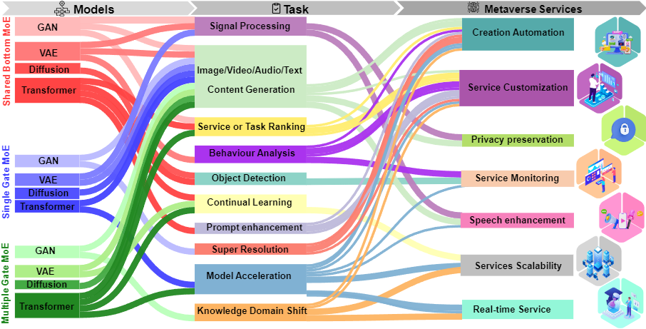

# MOEGAI-metaverse

This graph showcases various models and tasks, each cited with relevant research papers. Below, find detailed information about each model and task, accompanied by their respective Refs.

## GAN

### Shared Bottom MoE
- **Task:** Data Augmentation - Object Detection.
**Ref:** [Data Augmentation for Intelligent Mechanical Fault Diagnosis Based on Local Shared Multiple-Generator GAN](https://ieeexplore.ieee.org/abstract/document/9745551/)

- **Task:** Conetent Generation - Image.
**Ref:** [MCL-GAN: Generative Adversarial Networkswith Multiple Specialized Discriminators](https://proceedings.neurips.cc/paper_files/paper/2022/file/beac6bfb7eac3d651307c16ac747df01-Paper-Conference.pdf)

### Single Gate MoE
- **Task:** Conetent Generation - Image.
**Ref:** [Megan: Mixture of experts of generative adversarial networks for multimodal image generation](https://arxiv.org/abs/1805.02481)

### Multiple Gate MoE
- **Task:** Speech Enhancement; Conetent Generation - Audio.
**Ref:** [Perceptual Loss Function for Speech Enhancement Based on Generative Adversarial Learning](https://ieeexplore.ieee.org/document/9980170)

## VAE

### Shared Bottom MoE
- **Task:** Continual Learning.
**Ref:** [Mixture-of-Variational-Experts for Continual Learning](https://arxiv.org/abs/2110.12667)

### Single Gate MoE
- **Task:** Behaviour Analysis - Anomaly Detection.
**Ref:** [Mixture of experts with convolutional and variational autoencoders for anomaly detection](https://link.springer.com/article/10.1007/s10489-020-01944-5)

### Multiple Gate MoE
- **Task:** Cross Modality Content Generation.
**Ref:** [Variational Mixture-of-Experts Autoencoders for Multi-Modal Deep Generative Models](https://proceedings.neurips.cc/paper/2019/hash/0ae775a8cb3b499ad1fca944e6f5c836-Abstract.html)

## Diffusion

### Shared Bottom MoE
- **Task:** Conetent Generation - Image.
**Ref:** [Ernie-vilg 2.0: Improving text-to-image diffusion model with knowledge-enhanced mixture-of-denoising-experts](https://openaccess.thecvf.com/content/CVPR2023/html/Feng_ERNIE-ViLG_2.0_Improving_Text-to-Image_Diffusion_Model_With_Knowledge-Enhanced_Mixture-of-Denoising-Experts_CVPR_2023_paper.html)

### Single Gate MoE
- **Task:** Super Resolution.
**Ref:** [Image super-resolution via latent diffusion: A sampling-space mixture of experts and frequency-augmented decoder approach](https://arxiv.org/pdf/2310.12004.pdf)

### Multiple Gate MoE
- **Task:** Conetent Generation - Image.
**Ref:** [RAPHAEL: Text-to-Image Generation via Large Mixture of Diffusion Paths](https://proceedings.neurips.cc/paper_files/paper/2023/hash/821655c7dc4836838cd8524d07f9d6fd-Abstract-Conference.html)

## Transformer

### Shared Bottom MoE
- **Task:** Knowledge Domain Shift; Prompt enhancement.
**Ref:** [Diversifying content generation for commonsense reasoning with mixture of knowledge graph experts](https://arxiv.org/abs/2203.07285)

### Single Gate MoE
- **Task:** Model Acceleration.
**Ref:** [DeepSpeed-MoE: Advancing Mixture-of-Experts Inference and Training to Power Next-Generation AI Scale](https://proceedings.mlr.press/v162/rajbhandari22a.html)

- **Task:** Conetent Generation - Image.
**Ref:** [STABLEMOE: Stable Routing Strategy for Mixture of Experts](https://arxiv.org/abs/2204.08396)

### Multiple Gate MoE
- **Task:** Model Acceleration; Conetent Generation - Image.
**Ref:** [M³ViT: Mixture-of-Experts Vision Transformer for Efficient Multi-task Learning with Model-Accelerator Co-design](https://proceedings.neurips.cc/paper_files/paper/2022/hash/b653f34d576d1790481e3797cb740214-Abstract-Conference.html)

- **Task:** Image Classification.
**Ref:** [Scaling Vision with Sparse Mixture of Experts](https://proceedings.neurips.cc/paper/2021/hash/48237d9f2dea8c74c2a72126cf63d933-Abstract.html)
